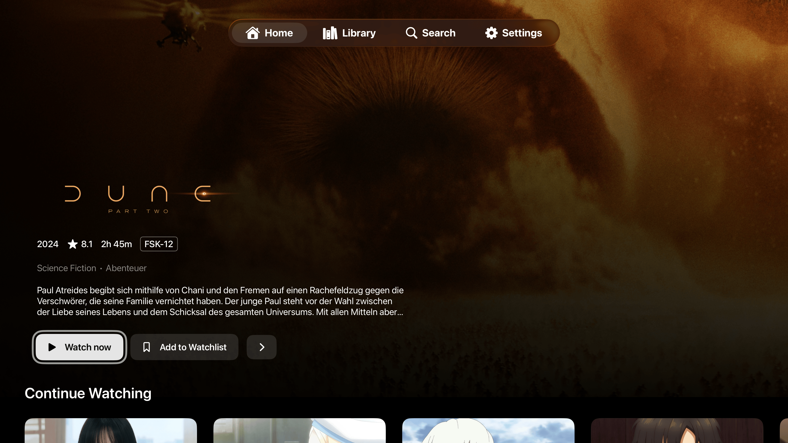
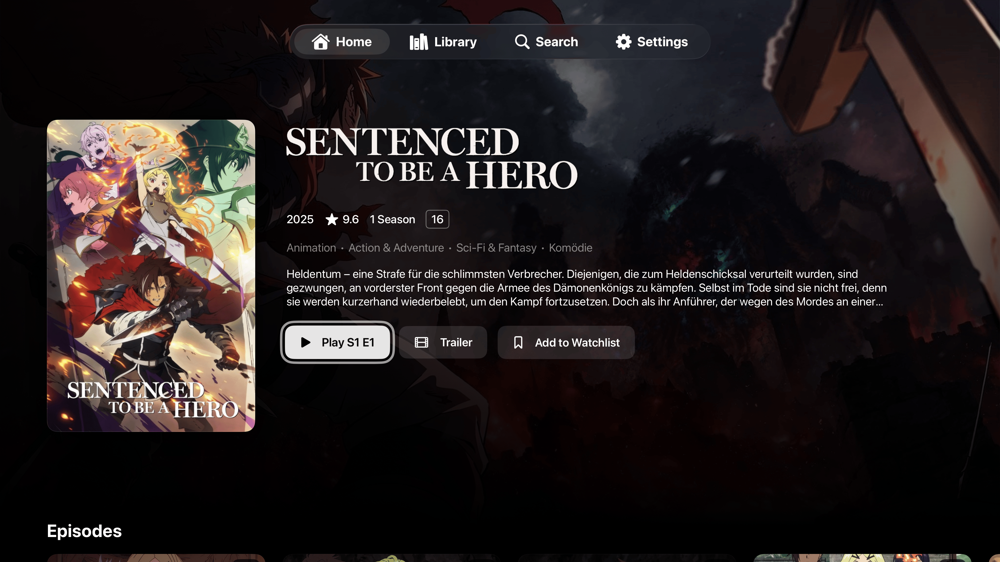
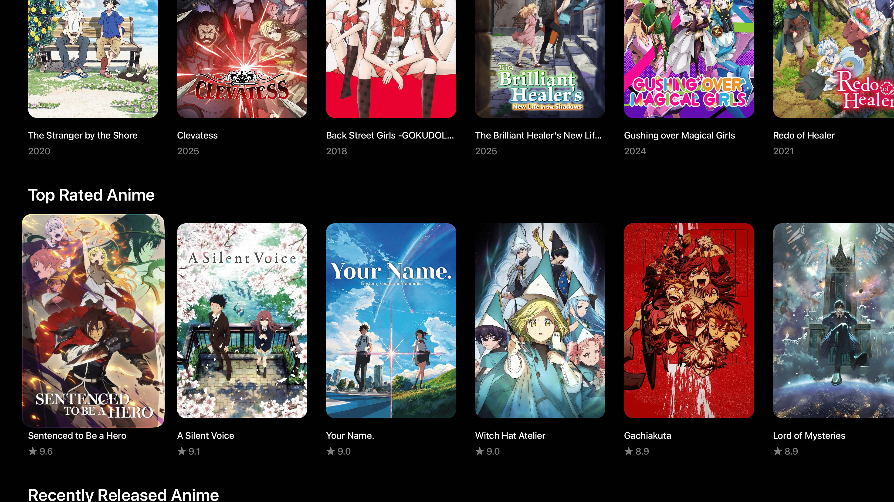
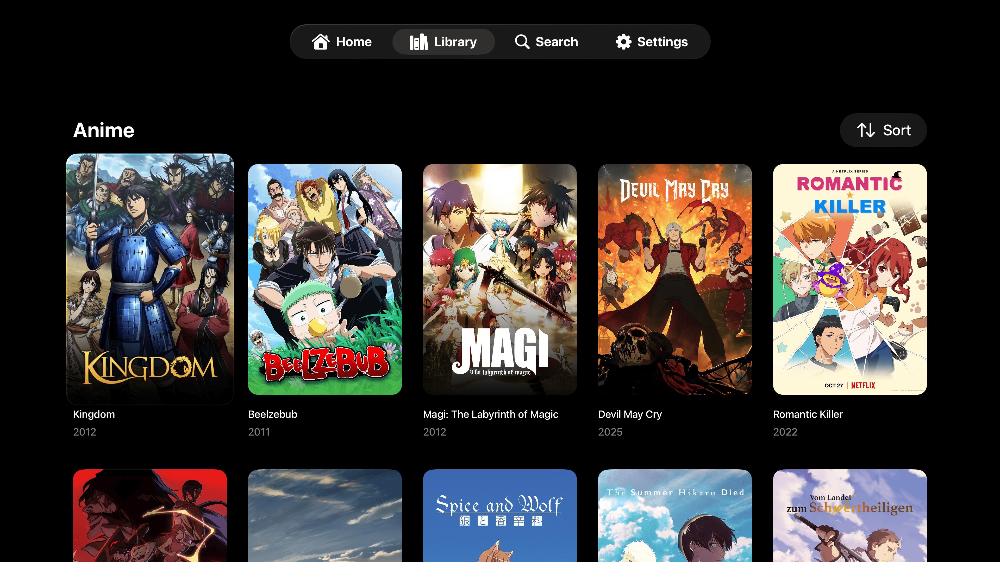
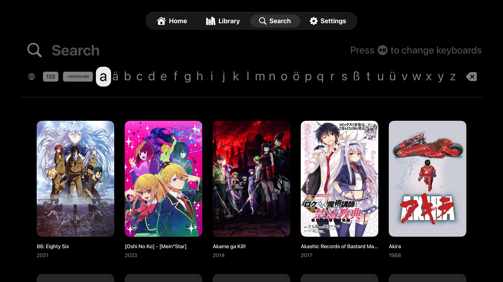

# Pelagica for Apple TV

This is the Apple TV app for [Pelagica](https://github.com/PelagicaApp/pelagica), a client for [Jellyfin](https://jellyfin.org).



### Screenshots

<table>
  <tr>
    <td>
      
    </td>
    <td>
      
    </td>
  </tr>
  <tr>
    <td>
      
    </td>
    <td>
      
    </td>
  </tr>
</table>

> Screenshots may include media artwork used for demonstration purposes only.

## Installation

### App Store

> The app isn't yet available on the App Store yet.

### TestFlight

You can join the [TestFlight beta](https://testflight.apple.com/join/CUsEZtDK) to try out beta builds of Pelagica for Apple TV. TestFlight builds may be unstable and are not guaranteed to work.

### Building it yourself

1. Install [Xcode](https://apps.apple.com/app/xcode/id497799835) 26 or later (the project targets tvOS 26.5).
2. Clone the repository:

```bash
git clone https://github.com/PelagicaApp/pelagica-atv.git
cd pelagica-atv
```

3. Open `Pelagica.xcodeproj` in Xcode. Swift Package Manager will automatically resolve the [jellyfin-sdk-swift](https://github.com/jellyfin/jellyfin-sdk-swift) dependency on first build.
4. Select the `Pelagica` scheme and an Apple TV simulator or a physical Apple TV as the run destination.
5. If deploying to a physical Apple TV, select your own team under the target's _Signing & Capabilities_ tab so Xcode can code-sign the build.
6. Build and run (`Cmd+R`).

## Discord

For discussions about Pelagica, join the [JellyfinCommunity](https://discord.gg/VKqprjh3Wr) and head to the `#pelagica` channel.

## Disclaimer

This project is a third-party frontend for Jellyfin and is not affiliated with the Jellyfin project.

Jellyfin is a media server designed to organize and stream legally obtained media. This project does not provide, host, or encourage access to pirated content.

The movie posters and images shown in the examples are not owned by me and are only used for demonstration purposes. All rights belong to their respective owners.

## License

This project is licensed under the GNU General Public License v3.0 - see the [LICENSE](./LICENSE) file for details.
